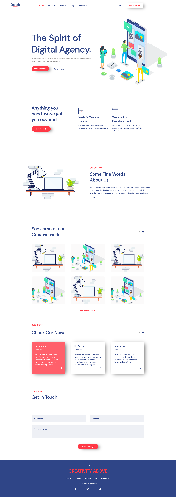
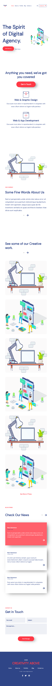

# Company Website Template UI

A ReactJS powered Company webpage template.

## Installation & Setup

Clone this repository and install its dependencies.

        > git clone https://github.com/temmietope/company-website-template

        > cd company-website-template

        > npm install

        > npm serve

Application is live on port 3000

        http://localhost:3000

Or you can view online on [https://doob.netlify.com/](https://doob.netlify.com/)

## Screenshots

##### Desktop view

##### Mobile view

## Repository

[https://github.com/temmietope/company-website-template](https://github.com/temmietope/company-website-template)
